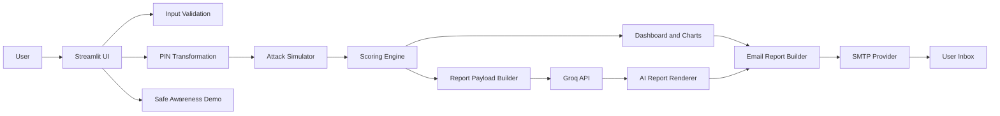
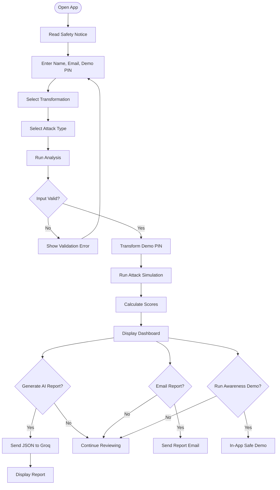
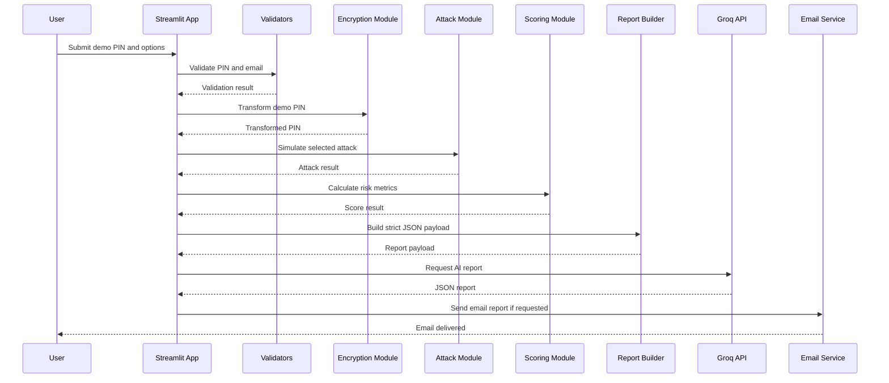
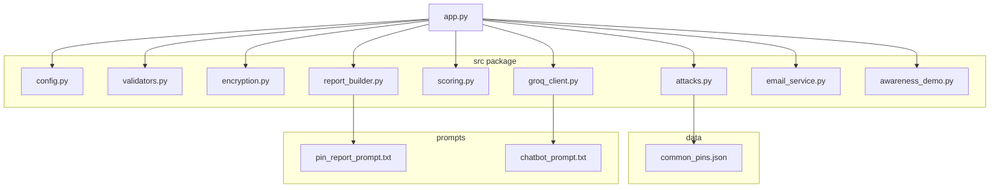
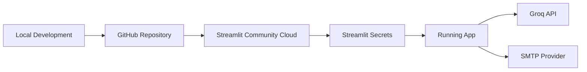

# Hit & Check Architecture

This file contains Mermaid diagrams for system architecture, user flow, data flow, and low-level module design.

## High-Level System Architecture

## User Flow

## Data Flow

## Low-Level Module Architecture

## Deployment Architecture

